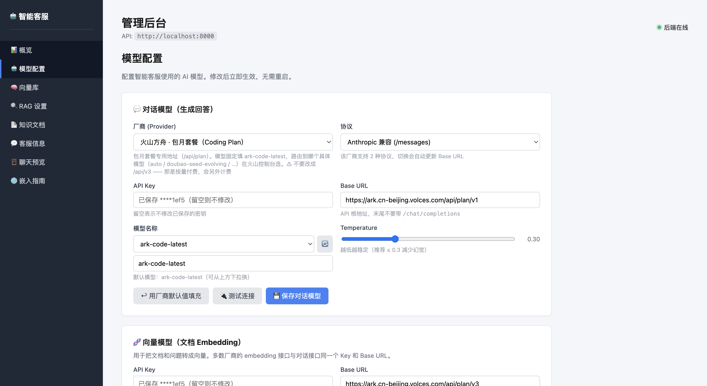
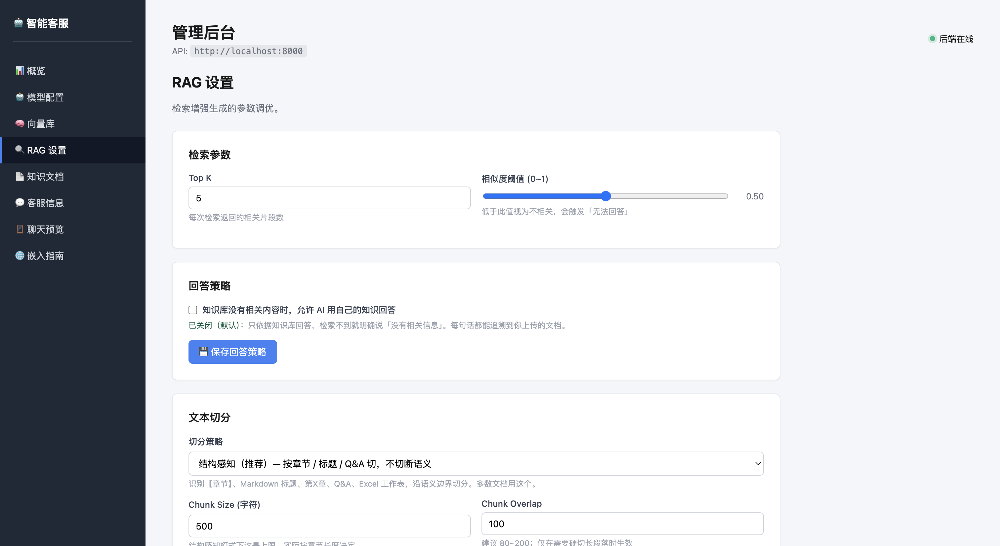
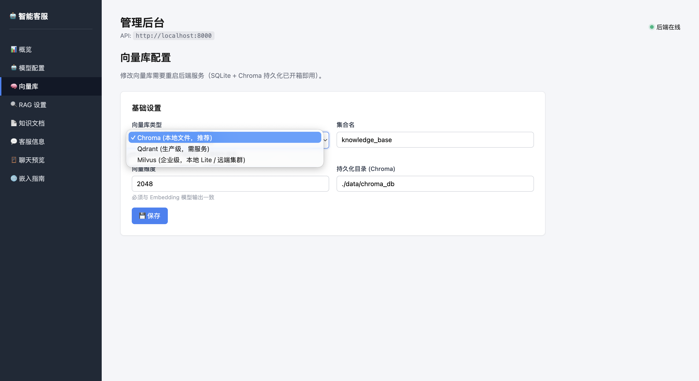
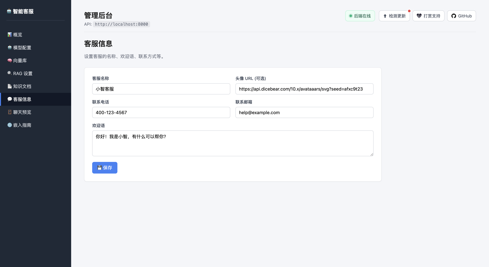
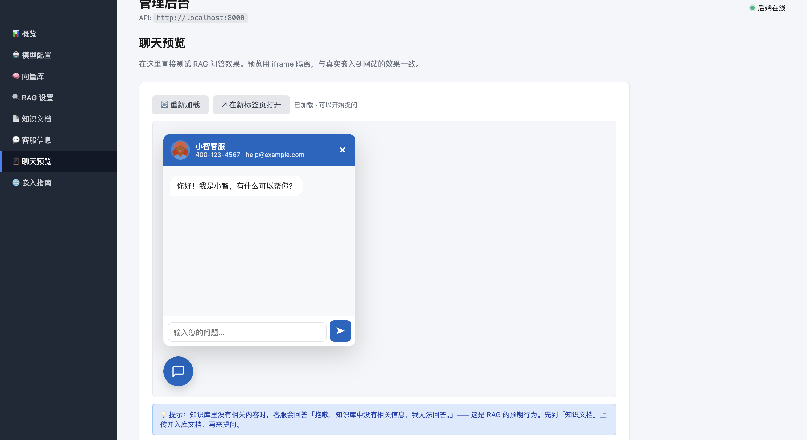
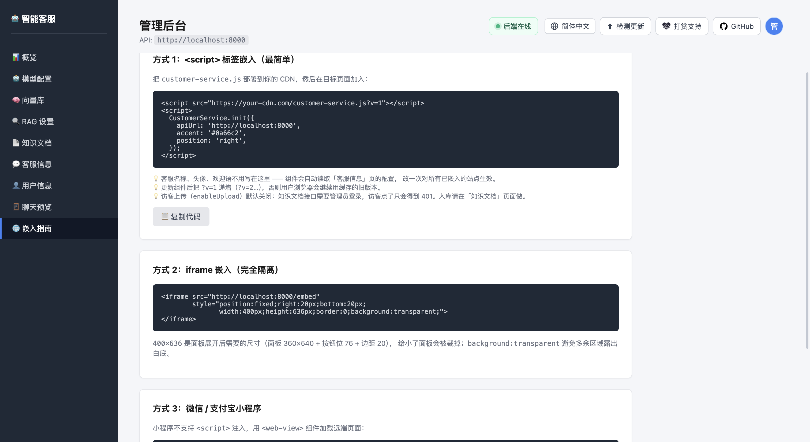
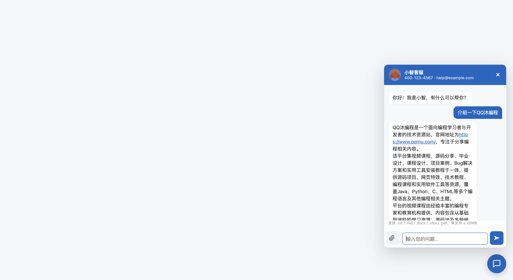

# 🤖 Intelligent Customer Service

[简体中文](README.md) · **English**

> A multi-model, RAG-powered customer-service platform built on **FastAPI**.
> **Install deps, hit Run, configure everything in the browser** — no config
> files to edit, no init scripts to run.


**Repositories**

| Host | URL | Notes |
| --- | --- | --- |
| GitHub | https://github.com/vfaner/intelligent-customer-service | Primary repo — file issues and PRs here |
| Gitee | https://gitee.com/super_rgh/intelligent-customer-service | Mirror for users in mainland China (faster clones); sync-only, no PRs |

---

## Contents

- [Three steps to run](#three-steps-to-run)
- [Screenshots](#screenshots)
- [Features](#features)
- [Admin console tour](#admin-console-tour)
- [Architecture](#architecture)
- [Project layout](#project-layout)
- [Supported model vendors](#supported-model-vendors)
- [Vector databases](#vector-databases)
- [Structure-aware chunking](#structure-aware-chunking)
- [Answer policy: strict RAG or model knowledge](#answer-policy-strict-rag-or-model-knowledge)
- [Embedding into your site](#embedding-into-your-site)
- [API reference](#api-reference)
- [Configuration](#configuration)
- [FAQ](#faq)
- [Development](#development)
- [Deployment](#deployment)

---

## Three steps to run

### 1. Install

```bash
cd backend
python3 -m venv .venv
source .venv/bin/activate          # Windows: .venv\Scripts\activate
pip install -r requirements.txt
```

### 2. Start

**PyCharm**: right-click `backend/run.py` → **Run**

**Terminal**:

```bash
python run.py
```

You'll see:

```
==============================================================
  🤖 IntelligentCustomerService
==============================================================
  ⚙️  Admin      http://localhost:8000/admin/     ← start here
  🪟  Demo       http://localhost:8000/widget/demo/
  📖  API docs   http://localhost:8000/docs
--------------------------------------------------------------
  ⚠  No chat-model API key configured yet
     → fill it in on the admin page, no file editing needed
==============================================================
```

> If a dependency is missing, the error names **your current interpreter** and
> the exact install command. `python run.py --install` installs them for you.

### 3. Configure in the browser

Open **http://localhost:8000/admin/**

| Step | What to do |
|---|---|
| 1️⃣ | If a yellow banner appears at the top, click **"🚀 One-click init"** (creates tables, dirs, default config) |
| 2️⃣ | **Model config** → pick a vendor → paste API key → **"🔌 Test connection"** → **"💾 Save"** |
| 3️⃣ | Same page, **🧬 Embedding model** → **"⬆︎ Reuse chat model's key/URL"** → **"🔌 Test & detect dimension"** |
| 4️⃣ | **Knowledge docs** → drop in txt/md/docx/xlsx/pdf → parsed and indexed automatically |
| 5️⃣ | **Chat preview** → ask a question to verify |

You never need to edit `.env` or run `init_db.py`.

<details>
<summary>CLI flags</summary>

```bash
python run.py --port 9000        # different port
python run.py --host 0.0.0.0     # allow LAN access
python run.py --no-reload        # disable hot reload
python run.py --open             # open the browser on start
python run.py --install          # auto-install missing deps
```

Standard uvicorn works too: `uvicorn src.main:app --reload --port 8000`
</details>

---

## Screenshots

<table>
<tr>
<td width="50%"><b>🤖 Model config</b><br>15 vendor presets; picking one fills in the base URL and model. Connection test and dimension detection included.</td>
<td width="50%"><b>🔍 RAG settings</b><br>Answer-policy switch, retrieval parameters, chunking strategy — with a live chunking preview.</td>
</tr>
<tr>
<td></td>
<td></td>
</tr>
<tr>
<td><b>🧠 Vector store</b><br>Chroma / Qdrant / Milvus, with only the relevant fields shown.</td>
<td><b>💬 Agent profile</b><br>Name, avatar, greeting, contact details — set once, applies to every embedded site.</td>
</tr>
<tr>
<td></td>
<td></td>
</tr>
<tr>
<td><b>🪟 Chat preview</b><br>Test RAG answers inside the console. Markdown is rendered and links are clickable.</td>
<td><b>🌐 Embed guide</b><br>script / iframe / mini-program snippets, one click to copy.</td>
</tr>
<tr>
<td></td>
<td></td>
</tr>
</table>

**What visitors see** — a floating button in the corner that opens the chat window:

<p align="center">
  
</p>

---

## Features

| Area | What you get |
|---|---|
| **📄 Knowledge base** | `txt` / `md` / `docx` / `xlsx` / `pdf` → structure-aware chunking → embedding → indexed. MD5 dedup, **resumable ingestion** |
| **🧠 Smart chunking** | Recognises `【sections】`, Markdown headings, `第X章`, Q&A pairs, Excel sheets; splits on semantic boundaries and keeps heading context |
| **🤖 Multi-model** | 15 vendor presets: DeepSeek, Qwen/Bailian, Volcengine ARK (subscription and metered kept separate), Zhipu, Kimi, Qianfan, OpenAI, Claude, Gemini, Ollama, Shengsuanyun, Youyunjisuan, plus 2 custom slots |
| **🔁 Dual protocol** | OpenAI `/chat/completions` and Anthropic `/messages`; switching protocol updates the base URL |
| **🗂 Three vector stores** | **Chroma** (default, local files) / **Qdrant** / **Milvus** (incl. zero-install Lite) |
| **🎯 Answer policy** | Strict RAG by default (refuse anything outside your docs); optional switch to let the model answer from its own knowledge |
| **⚡ Streaming** | SSE token streaming, with automatic 429 retry so a rate limit doesn't kill the reply |
| **🪟 Embeddable widget** | Single-file JS, zero dependencies, no build step. Renders Markdown and makes links clickable |
| **📲 Cross-platform** | Websites / WeChat mini-program `web-view` / Electron / Tauri / iOS / Android |
| **⚙️ Browser-only config** | Models, vector store, RAG params, agent profile — all editable in the UI, effective immediately without a restart |

---

## Admin console tour

Eight menu items on the left of `/admin/`:

| Menu | Purpose |
|---|---|
| 📊 **Overview** | System status, current model, vector store, document count |
| 🤖 **Model config** | Chat model (vendor/protocol/key/model/temperature) + embedding model, with connection test and **automatic dimension detection** |
| 🧠 **Vector store** | Switch between Chroma / Qdrant / Milvus |
| 🔍 **RAG settings** | **Answer-policy switch** + top-K/threshold + chunking, with **chunking preview** |
| 📄 **Knowledge docs** | Drag-and-drop upload, **live ingestion progress**, resume on failure, delete |
| 💬 **Agent profile** | Name, avatar, greeting, contacts (the widget reads these automatically) |
| 🪟 **Chat preview** | The real widget in an iframe — test RAG answers here |
| 🌐 **Embed guide** | Three embedding methods, copy-paste ready |

Three persistent tools sit in the top-right corner:

| Tool | Behaviour |
|---|---|
| 🟢 **Backend status** | Polls every 15s. Hover to see the full error when offline |
| ⬆︎ **Check for updates** | Compares the running version with the latest GitHub release; a red dot appears when one is available |
| ☕ **Donate** | WeChat / Alipay / QQ QR codes |

> **The update check needs a repo**: set `APP_GITHUB_REPO=owner/repo` in
> `backend/.env`. Without it the button explains how to configure it rather
> than failing.
>
> It **only checks — it never touches your code**. When a newer release exists
> it shows the release notes and the update commands, and you decide when to
> run them. Auto-`git pull` would overwrite uncommitted local changes and can
> leave the service unable to start, so it isn't wired to a button.

---

## Architecture

```
┌──────────── Browser ────────────┐        ┌─────────── FastAPI backend ────────┐
│  customer-service.js (0 deps)   │  HTTP  │  api · services · adapters         │
│   float button + chat + upload  │ ◀────▶ │  vector_store · embeddings         │
│   SSE streaming + Markdown      │  SSE   │  parsers · prompts · models        │
└─────────────────────────────────┘        └──┬────────┬──────────┬────────────┘
                                              │        │          │
                                          SQLite    Chroma /   LLM vendors
                                          /MySQL    Qdrant /   (15 presets)
                                          (sessions) Milvus
```

**LLM adapters** (async + SSE, automatic 429 retry):

```
BaseProvider
  ├── OpenAIStyleProvider     → POST {base}/chat/completions
  └── AnthropicStyleProvider  → POST {base}/messages
                                (system is a top-level field; sends both
                                 x-api-key and Authorization: Bearer so
                                 vendor gateways all work)
build_provider() dispatches on protocol
```

---

## Project layout

```
intelligent-customer-service/
├── backend/
│   ├── run.py                        ← one-click start (PyCharm: right-click → Run)
│   ├── requirements.txt
│   ├── .env.example                  (optional; UI config takes precedence)
│   ├── docker-compose.yml            MySQL + Redis + Qdrant + Milvus
│   ├── src/
│   │   ├── main.py                   FastAPI app factory
│   │   ├── api/                      admin · chat · config · documents · models · sessions
│   │   ├── services/                 document · rag · llm · embedding · session
│   │   ├── adapters/                 base · openai · anthropic · factory
│   │   ├── vector_store/             base · chroma · qdrant · milvus · factory
│   │   ├── embeddings/               base · openai_compatible_embedder
│   │   ├── parsers/                  txt (incl. md) · docx · xlsx · pdf
│   │   ├── prompts/system_prompts.py RAG constraints + fallback prompts
│   │   ├── models/                   SQLAlchemy ORM
│   │   ├── core/                     config · database · registry · exceptions
│   │   ├── utils/                    text_splitter (structure-aware) · sse · hash · obfuscation
│   │   └── tests/                    36 tests
│   ├── scripts/
│   │   ├── init_db.py                create tables (one-click init covers this)
│   │   ├── check_env.py              dependency/config self-check
│   │   ├── ingest_docs.py            bulk import
│   │   └── ingest_retry.py           ← auto-retry ingestion for large corpora
│   └── samples/                      sample knowledge doc
├── frontend/
│   ├── admin/
│   │   ├── index.html                admin console
│   │   └── embed.html                standalone chat page (preview / iframe)
│   ├── assets/                       icons, donate QR codes, screenshots
│   └── widget/
│       ├── customer-service.js       embeddable widget (zero deps)
│       ├── selftest.mjs              ← 17 assertions in a real DOM
│       └── demo/                     embedding demos
└── docs/
    ├── API.md · DEPLOYMENT.md · EMBED_GUIDE.md
    └── qqmu-knowledge-base/          sample corpus (regenerable via scripts)
```

---

## Supported model vendors

The dropdown groups vendors and custom slots. Picking a vendor fills in its
base URL and default model; click 🔄 to fetch the models **your account can
actually use**.

| Vendor | Protocol | Notes |
|---|---|---|
| DeepSeek | openai | Good price/performance |
| Alibaba Cloud · Qwen / Bailian | openai | Shares the DashScope compatible endpoint |
| Volcengine ARK · **subscription** | openai + anthropic | `/api/plan/v3`, `/api/plan/v1`; model must be `ark-code-latest` |
| Volcengine ARK · **Doubao** (metered) | openai | `/api/v3` |
| Zhipu GLM | openai | |
| Kimi (Moonshot) | openai | |
| Baidu Qianfan (ERNIE) | openai | v2 endpoint |
| OpenAI | openai | |
| Anthropic Claude | anthropic | Native Messages protocol |
| Shengsuanyun (router) | openai | Aggregates several vendors |
| Youyunjisuan ⚠ | openai | |
| Google Gemini ⚠ | openai | Via the OpenAI-compatible endpoint |
| Ollama (local) ⚠ | openai | `localhost:11434`, any key works |
| Custom (OpenAI protocol) | openai | vLLM / one-api / LiteLLM / your own gateway |
| Custom (Anthropic protocol) | anthropic | Any Anthropic-compatible layer |

> **⚠ marks presets I could not verify against the vendor**; the UI shows an
> orange warning for them. Check the vendor's docs, or click 🔄 to fetch the
> real model list. Everything else has been tested against a live account.

### ⚠️ Volcengine ARK users

ARK has **two products with different billing**. Picking the wrong one costs
money:

| Your situation | Choose | Base URL |
|---|---|---|
| You bought a **Coding Plan subscription** | ARK · subscription | `/api/plan/v3` (OpenAI) or `/api/plan/v1` (Anthropic) |
| **Pay-as-you-go** | ARK · Doubao | `/api/v3` |

For the subscription the model name must be `ark-code-latest`; which
underlying model it routes to is chosen in the ARK console.

---

## Vector databases

Switch under **Vector store**. After switching you must **restart the backend
and re-ingest your documents** — vector data doesn't migrate between stores.

| Store | Notes | Extra service? |
|---|---|---|
| **Chroma** (default) | Local files under `./data/chroma_db` | ❌ works out of the box |
| **Qdrant** | Rust, production-grade | ✅ `docker compose up -d qdrant` |
| **Milvus** | Enterprise-grade. A `.db` path uses **Milvus Lite** (zero install); `http://host:19530` connects to a server; Zilliz Cloud also works | Depends on mode |

---

## Structure-aware chunking

The default strategy. Instead of cutting every N characters, it splits on
semantic boundaries and keeps the heading context.

Measured on `samples/sample_knowledge.txt` (595 chars):

| | Fixed window | Structure-aware |
|---|---|---|
| Chunks | 2 | **6** |
| Problem | Four sections crammed together; another chunk started mid-`Q3`, losing the `【FAQ】` context | Each section its own chunk, heading intact |
| Top-1 score for "warranty period" | 0.719 | **0.791** |

**Recognised structures**: `【section】` · Markdown `#`–`######` (with nesting)
· `第X章` · `Q:/A:` pairs · `## Sheet:` (Excel) · `## Page N` (PDF)

Numbered list items like `1. Warranty is 12 months.` are **not** mistaken for
headings.

**Tune it in the UI** under *RAG settings → Chunking*:

- **Strategy** — structure-aware / fixed window
- **Heading prefix** — long sections carry a `[Specs]` prefix on each chunk
- **🔍 Preview chunking** — pick a document or paste text and see the chunk
  count, size distribution and section attribution **without ingesting**

---

## Answer policy: strict RAG or model knowledge

A switch under *RAG settings → Answer policy*, **off** by default.

| | Off (default) | On |
|---|---|---|
| Knowledge base has the answer | Answers from your docs | Answers from your docs, fills gaps if needed |
| Knowledge base **doesn't** | "Sorry, I don't have that information" | Answers from the model's own knowledge |
| Traceability | ✅ Every sentence traces to your docs | ❌ Users can't tell which parts came from your docs |
| Good for | Pricing, policies, commitments | General Q&A, tech support |

Measured (asking for the height of Mount Everest):

```
Off: 🚫 Sorry, I don't have that information in the knowledge base.
On:  ✅ Mount Everest's official height is 8,848.86 m, announced jointly by
        China and Nepal in December 2020…
```

**On-topic questions are unaffected** when the switch is on — "do you have 404
page templates?" still answers from the knowledge base.

<details>
<summary>Why <code>relevance_threshold</code> (0.76) exists</summary>

With CJK embeddings, **completely unrelated text still scores around 0.65**.
Meanwhile `similarity_threshold` has to stay low (0.5) or short queries like
"login page" retrieve nothing at all.

Measured score distribution on this corpus:

```
On-topic:  0.813 0.827 0.833 0.836 0.850 0.859 0.905
Off-topic: 0.649 0.665 0.680 0.702 0.711
Gap: +0.102  → threshold set at 0.76
```

So `relevance_threshold` separates "we retrieved something" from "we retrieved
an answer". Other corpora may need this tuned.
</details>

---

## Embedding into your site

### Option 1: `<script>` tag (simplest)

```html
<script src="http://localhost:8000/widget/customer-service.js?v=1"></script>
<script>
  CustomerService.init({
    apiUrl: 'http://localhost:8000',
    accent: '#0a66c2',
    position: 'right',      // 'left' | 'right'
    enableUpload: true,
  });
</script>
```

> Agent name, avatar and greeting **don't belong here** — the widget reads them
> from the *Agent profile* page, so one edit applies everywhere.
> `?v=1` is a cache-buster; bump it after updating the widget.

### Option 2: iframe (full isolation)

```html
<iframe src="http://localhost:8000/embed?api=http://localhost:8000"
        style="position:fixed;right:20px;bottom:20px;width:400px;height:636px;
               border:0;background:transparent;">
</iframe>
```

> **Size it properly and keep it transparent.** The expanded panel needs
> `400 × 636` (panel 360×540 + button clearance 76 + margin 20). Smaller clips
> the panel; without `background: transparent` the unused area shows the
> iframe's own colour as a visible block.

`/embed` accepts `api` · `title` · `accent` · `position` · `autoOpen` ·
`upload` · `bg`.

### Option 3: mini-programs

```xml
<web-view src="https://your-domain/embed?api=https://your-api-domain" />
```

Remember to whitelist the domain in the mini-program console.

### Widget options

| Option | Default | Meaning |
|---|---|---|
| `apiUrl` | `http://localhost:8000` | Backend base URL |
| `title` / `subtitle` | from backend | Header text (passing it overrides the backend) |
| `avatar` | from backend | Image URL; falls back to the first character on error |
| `welcome` | from backend | First assistant message |
| `accent` | `#0a66c2` | Theme colour |
| `position` | `right` | Corner for the floating button |
| `autoOpen` | `false` | Open on load |
| `enableUpload` | `true` | Show the upload button |
| `useServerConfig` | `true` | Pull agent profile from `/api/config` |
| `sessionId` | `null` | Resume a previous session |
| `onReady` | `null` | Callback after init |

```js
CustomerService.open() / close() / toggle() / sendMessage(text) / destroy()
```

See [docs/EMBED_GUIDE.md](docs/EMBED_GUIDE.md) for Electron / Tauri / iOS /
Android / CSP details.

---

## API reference

Swagger: **http://localhost:8000/docs** · Details: [docs/API.md](docs/API.md)

| Method | Path | Purpose |
|---|---|---|
| `GET` | `/health` | Health check |
| `GET` | `/api/admin/status` | Install status (drives the setup banner) |
| `POST` | `/api/admin/init` | One-click init (idempotent) |
| `GET` | `/api/admin/version` | Update check against the latest GitHub release |
| `GET` `PUT` | `/api/config` | Read / update all config |
| `GET` | `/api/config/providers` | Vendor registry |
| `POST` | `/api/documents/upload` | Upload a document (multipart) |
| `POST` | `/api/documents/process` | Chunk + embed + index (resumable) |
| `POST` | `/api/documents/split-preview` | Preview chunking without ingesting |
| `GET` | `/api/documents/list` | Documents with ingestion progress |
| `DELETE` | `/api/documents/{id}` | Delete a document and its vectors |
| `GET` | `/api/documents/parsers` | Supported file types |
| `POST` | `/api/chat` | One-shot answer (JSON) |
| `POST` | `/api/chat/stream` | **Streaming answer (SSE)** |
| `GET` `POST` | `/api/sessions` | List / create sessions |
| `GET` | `/api/sessions/{id}/messages` | Session history |
| `POST` | `/api/sessions/{id}/close` | Close a session |
| `GET` | `/api/models` | Models + vector stores overview |
| `POST` | `/api/models/available` | Fetch the vendor's real model list |
| `POST` | `/api/models/test` | Test the chat model |
| `POST` | `/api/models/test-embedding` | Test embedding and detect dimension |
| `GET` | `/api/models/vector-db` | Vector store list |

**Static pages** (served by the backend — no separate web server needed):

| Path | What |
|---|---|
| `/` | Landing page with shortcuts |
| `/admin/` | **Admin console** |
| `/embed` | Standalone chat page for iframes (query string preserved) |
| `/widget/customer-service.js` | The widget |
| `/widget/demo/` | Embedding demos |
| `/assets/` | Icons, QR codes, screenshots |
| `/docs` · `/redoc` | Swagger / ReDoc |

**SSE events** on `/api/chat/stream`:

```
event: meta      → first, carries {session_id}
event: token     → incremental text {text}
event: sources   → citations (heading / score / filename)
event: done      → {ok}
event: error     → {message}
```

---

## Configuration

**UI config takes precedence over `.env`** — you never need to touch `.env` in
normal use. This table is for deployment scripts and CI.

<details>
<summary>All .env variables</summary>

> ⚠️ Variables in the App section **need the `APP_` prefix** (pydantic-settings
> `env_prefix`). The template once used bare `DEBUG` / `PORT` / `SECRET_KEY`,
> which were silently ignored — a production deploy stayed in debug mode.

| Group | Variable | Default |
|---|---|---|
| App | `APP_ENV` / `APP_DEBUG` / `APP_HOST` / `APP_PORT` | `development` / `true` / `0.0.0.0` / `8000` |
| | `APP_SECRET_KEY` | `change-me-in-production` |
| | `UPLOAD_DIR` / `MAX_UPLOAD_MB` | `./uploads` / `20` |
| | `APP_GITHUB_REPO` / `APP_VERSION` | empty / `0.1.0` (update check) |
| Database | `DATABASE_URL` | `sqlite+aiosqlite:///./data/app.db` |
| Redis | `REDIS_URL` / `REDIS_ENABLED` | empty / `false` |
| Vector store | `VECTOR_DB_PROVIDER` | `chroma` (`chroma`\|`qdrant`\|`milvus`) |
| | `VECTOR_DB_HOST` / `_PORT` / `_COLLECTION` | `localhost` / `6333` / `knowledge_base` |
| | `VECTOR_DB_EMBEDDING_DIM` | `1024` |
| | `CHROMA_PERSIST_DIR` | `./data/chroma_db` |
| | `VECTOR_DB_MILVUS_URI` / `_TOKEN` / `_DB_NAME` | `./data/milvus.db` / empty / empty |
| LLM | `LLM_PROVIDER` / `_API_KEY` / `_BASE_URL` / `_MODEL` | `deepseek` / empty / … / `deepseek-chat` |
| | `LLM_TEMPERATURE` / `LLM_MAX_TOKENS` / `API_PROTOCOL` | `0.3` / `2048` / `openai` |
| Embedding | `EMBEDDING_API_KEY` / `_BASE_URL` / `_MODEL` / `_DIM` | empty / … / `text-embedding-3-small` / `1024` |
| RAG | `RAG_TOP_K` / `RAG_SIMILARITY_THRESHOLD` | `5` / `0.5` |
| | `RAG_CHUNK_SIZE` / `RAG_CHUNK_OVERLAP` | `500` / `100` |
| | `RAG_CHUNK_STRATEGY` / `RAG_CHUNK_PREFIX_HEADING` | `structure` / `true` |
| | `RAG_ALLOW_MODEL_KNOWLEDGE` / `RAG_RELEVANCE_THRESHOLD` | `false` / `0.76` |
| | `RAG_MAX_CONTEXT_CHARS` | `8000` |
| CORS | `CORS_ORIGINS` | `*` |

</details>

> ⚠️ **`backend/data/app.db` holds the API keys you enter in the UI**
> (base64-obfuscated, effectively plaintext). It's excluded by `.gitignore` —
> **never commit it to a public repo.**

---

## FAQ

<details>
<summary><b>"Missing dependency" but I already installed it</b></summary>

You likely installed into a different Python environment. The error prints
**your current interpreter's** full path — use that:

```bash
/your/venv/bin/python -m pip install -r requirements.txt
# or let the script handle it
python run.py --install
```

PyCharm users: check the interpreter in your Run Configuration matches.
</details>

<details>
<summary><b>Can I run it without an API key?</b></summary>

Yes. The service starts and everything that isn't an LLM call works. Endpoints
that need a model return a clear `llm_error` / `embedding_error`.
</details>

<details>
<summary><b>Everything answers "no relevant information"</b></summary>

1. Check *Knowledge docs* — status should be **ready** with chunk count > 0
2. Lower the **similarity threshold** in *RAG settings* (default 0.5)
3. Use **🔍 Preview chunking** to confirm the document split sensibly
4. To answer questions outside your docs, enable the answer-policy switch

If the knowledge base genuinely lacks the answer, this response is **correct
behaviour**.
</details>

<details>
<summary><b>Ingestion is slow or keeps failing</b></summary>

Usually the embedding vendor's quota (Volcengine ARK's is accumulated over a
long window, in my testing).

Ingestion is **resumable** — progress is kept, so clicking "Ingest" again
continues where it stopped without re-spending quota. For large corpora run it
in the background:

```bash
cd backend
python scripts/ingest_retry.py --cooldown 60
# or detached
nohup python scripts/ingest_retry.py > ingest.log 2>&1 &
```

For much faster ingestion, switch to an embedding service with a looser quota.
Note that changing the model changes the dimension, so you must update the
vector store dimension and **re-ingest everything**.
</details>

<details>
<summary><b>Retrieval broke after changing vector store / embedding model</b></summary>

The vector dimension must match the model's output, and **changing the model
requires re-ingesting** (old vectors have a different dimension).

Use **🔌 Test & detect dimension** — the UI reads the real dimension and syncs
it to the vector store config.
</details>

<details>
<summary><b>Volcengine ARK returns 401</b></summary>

Check you picked the right product (subscription vs pay-as-you-go) — their base
URLs differ:

- Subscription: `/api/plan/v3` (OpenAI) or `/api/plan/v1` (Anthropic)
- Pay-as-you-go: `/api/v3`

For the subscription the model name must be `ark-code-latest`.
</details>

<details>
<summary><b>429 during chat</b></summary>

Automatic retry is built in (45s budget, exponential backoff), so you rarely
see it. If it persists, your account quota is exhausted — wait, or move to a
model with more headroom.
</details>

<details>
<summary><b>SSE stops streaming behind Nginx</b></summary>

Turn buffering off:

```nginx
location /api/chat/stream {
    proxy_pass http://127.0.0.1:8000;
    proxy_buffering off;
    proxy_cache off;
    proxy_http_version 1.1;
    proxy_set_header Connection '';
    chunked_transfer_encoding off;
}
```

The backend already sends `X-Accel-Buffering: no`.
</details>

<details>
<summary><b>Frontend changes don't show up</b></summary>

The backend sends `Cache-Control: no-store` for `/admin`, `/widget` and
`/embed`, so a normal refresh is enough. If a CDN sits in front, purge it or
bump `?v=` on the embed URL.
</details>

<details>
<summary><b>Some packages won't install on Python 3.14</b></summary>

`langchain-text-splitters` failing is harmless — the splitter has a built-in
implementation and doesn't depend on it. Everything else is verified on
Python 3.14.5.
</details>

---

## Development

```bash
# Backend: 36 tests
cd backend
python -m pytest src/tests/ -q

# Widget self-test: 17 assertions, full SSE flow in a real DOM
cd frontend/widget
npm install       # installs jsdom
npm test

# Environment self-check
cd backend && python scripts/check_env.py
```

> The widget self-test earns its place: `node -c` only checks syntax and can't
> catch things like a template literal terminated early by an inner backtick,
> which breaks the whole widget at runtime. `npm test` executes the real
> rendering path.

---

## Deployment

Full guide: **[docs/DEPLOYMENT.md](docs/DEPLOYMENT.md)** (Nginx, HTTPS,
firewall, backups, upgrades, troubleshooting). The essentials:

### Three things to know first

1. **Only Nginx should face the internet.** The app binds `127.0.0.1:8000`; the
   admin console has no login, so exposing it directly hands out your API key
   configuration page.
2. **SSE needs buffering off in Nginx** — otherwise answers appear all at once
   instead of streaming (the most common deployment mistake).
3. **API keys live in `backend/data/app.db`** (base64-obfuscated, effectively
   plaintext). It's gitignored — don't commit it.

### Docker Compose

```bash
curl -fsSL https://get.docker.com | sh
cd /opt && git clone https://github.com/vfaner/intelligent-customer-service.git intelligent-customer-service
# Or, from mainland China, use the Gitee mirror:
# git clone https://gitee.com/super_rgh/intelligent-customer-service.git intelligent-customer-service
cd intelligent-customer-service
# Create backend/Dockerfile and docker-compose.prod.yml
# (full contents in docs/DEPLOYMENT.md)
cp backend/.env.example backend/.env && nano backend/.env
docker compose -f docker-compose.prod.yml up -d --build
curl -fsS http://127.0.0.1:8000/health
```

### systemd + Nginx

```bash
sudo apt install -y python3.12 python3.12-venv nginx git
sudo useradd -r -s /bin/false -d /opt/ics csapp
sudo mkdir -p /opt/ics && cd /opt/ics && sudo git clone https://github.com/vfaner/intelligent-customer-service.git .
# Gitee mirror: sudo git clone https://gitee.com/super_rgh/intelligent-customer-service.git .
sudo chown -R csapp:csapp /opt/ics
cd backend
sudo -u csapp python3 -m venv .venv
sudo -u csapp .venv/bin/pip install -r requirements.txt
sudo -u csapp cp .env.example .env && sudo nano .env
# Write /etc/systemd/system/ics.service (template in docs/DEPLOYMENT.md)
sudo systemctl enable --now ics
```

### Nginx (required either way)

```nginx
server {
    listen 443 ssl http2;
    server_name your-domain;
    client_max_body_size 25M;

    # ⚠ SSE: buffering must be off
    location /api/chat/stream {
        proxy_pass http://127.0.0.1:8000;
        proxy_http_version 1.1;
        proxy_buffering off;
        proxy_cache off;
        chunked_transfer_encoding off;
        proxy_read_timeout 300s;
    }

    location / {
        proxy_pass http://127.0.0.1:8000;
        proxy_set_header Host $host;
        proxy_set_header X-Forwarded-Proto $scheme;
    }
}
```

### Protect the admin console

It has **no built-in login**. Pick one, most secure first:

| Approach | How |
|---|---|
| **SSH tunnel** (recommended) | Don't expose it; `ssh -L 8000:127.0.0.1:8000 user@server`, open `localhost:8000/admin/` |
| **IP allowlist** | `allow your.ip; deny all;` on `/admin/` in Nginx |
| **Basic auth** | `htpasswd` + `auth_basic`, and protect `/api/config` `/api/admin` too |

### Security checklist

- [ ] `APP_SECRET_KEY` replaced with a random value
- [ ] `APP_ENV=production` and `APP_DEBUG=false` (debug leaks stack traces)
- [ ] `CORS_ORIGINS` restricted to real domains, not `*`
- [ ] Admin console access-controlled
- [ ] App bound to `127.0.0.1`; DB / Redis / vector store not published
- [ ] HTTPS enabled
- [ ] Not running as root
- [ ] Nginx rate-limit on `/api/chat*` (protects your LLM bill)
- [ ] `git check-ignore -v backend/data/app.db` confirms the DB is ignored
- [ ] Backups of `backend/data/` scheduled **and restore-tested**
- [ ] Aware that document content reaches the prompt (injection risk)

---

## License

MIT
