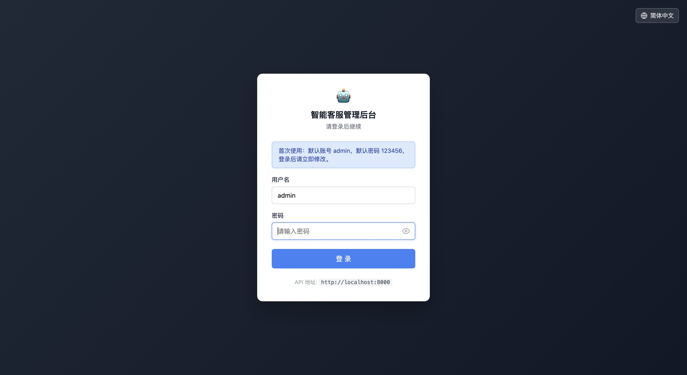
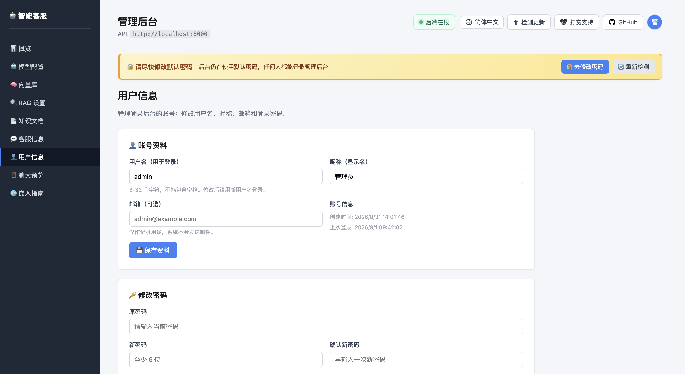
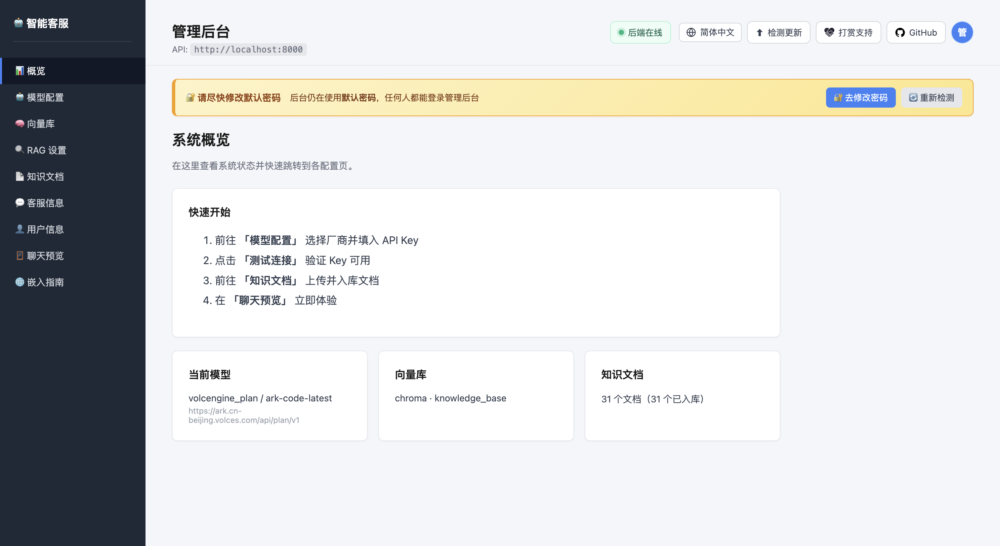
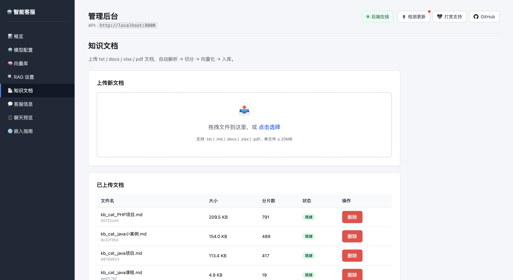

# 🤖 智能客服系统（Intelligent Customer Service）

**简体中文** · [English](README.en.md)

> 基于 **FastAPI + RAG** 的多模型智能客服平台。
> **装完依赖点一下运行，剩下全在网页上配** —— 不改配置文件，不跑初始化脚本。


**仓库地址**

| 平台 | 地址 | 说明 |
| --- | --- | --- |
| GitHub | https://github.com/vfaner/intelligent-customer-service | 主仓库，Issue / PR 请提到这里 |
| Gitee | https://gitee.com/super_rgh/intelligent-customer-service | 国内镜像，克隆更快，只做同步不接受 PR |

---

## 目录

- [三步跑起来](#三步跑起来)
- [登录与账号](#登录与账号)
- [效果预览](#效果预览)
- [核心特性](#核心特性)
- [页面导览](#页面导览)
- [架构](#架构)
- [目录结构](#目录结构)
- [支持的模型厂商](#支持的模型厂商)
- [向量数据库](#向量数据库)
- [换了 Embedding 模型？一键重建向量库](#换了-embedding-模型一键重建向量库)
- [智能分词（结构感知切分）](#智能分词结构感知切分)
- [回答策略：严格 RAG 还是允许自主回答](#回答策略严格-rag-还是允许自主回答)
- [嵌入到你的网站](#嵌入到你的网站)
- [多语言（离线也能自动选对语言）](#多语言离线也能自动选对语言)
- [API 速查](#api-速查)
- [配置项参考](#配置项参考)
- [常见问题](#常见问题)
- [开发与测试](#开发与测试)
- [生产部署](#生产部署)

---

## 三步跑起来

### 1. 装依赖

```bash
cd backend
python3 -m venv .venv
source .venv/bin/activate          # Windows: .venv\Scripts\activate
pip install -r requirements.txt
```

### 2. 启动

**PyCharm**：右键 `backend/run.py` → **Run**

**命令行**：

```bash
python run.py
```

启动后会打印：

```
==============================================================
  🤖 IntelligentCustomerService
==============================================================
  ⚙️  管理后台   http://localhost:8000/admin/     ← 从这里开始
  🪟  组件演示   http://localhost:8000/widget/demo/
  📖  API 文档   http://localhost:8000/docs
--------------------------------------------------------------
  ⚠  尚未配置对话模型 API Key
     → 打开管理后台「模型配置」填写即可，无需改文件
==============================================================
```

> 缺依赖时会提示**当前解释器**对应的安装命令；也可以 `python run.py --install` 自动装。

### 3. 打开管理后台配置

浏览器访问 **http://localhost:8000/admin/**

先登录：默认账号 **`admin`** / 密码 **`123456`**（首次启动自动创建，详见 [登录与账号](#登录与账号)）。

| 顺序 | 做什么 |
|---|---|
| 1️⃣ | 页面顶部若出现黄色横幅 → 点 **「🚀 一键初始化」**（建表 + 建目录 + 写默认配置） |
| 2️⃣ | 进 **「模型配置」** → 选厂商 → 填 API Key → **「🔌 测试连接」** → **「💾 保存」** |
| 3️⃣ | 同页 **「🧬 向量模型」** → **「⬆︎ 复用对话模型的 Key / URL」** → **「🔌 测试并探测维度」** |
| 4️⃣ | 进 **「知识文档」** → 拖入 txt/md/docx/xlsx/pdf → 自动解析入库 |
| 5️⃣ | 进 **「聊天预览」** → 直接提问验证 |
| 6️⃣ | 进 **「用户信息」** → **改掉默认密码**（页面顶部的 🔐 横幅会一直提醒你） |

**完全不需要**编辑 `.env`、执行 `init_db.py` 或任何脚本。

<details>
<summary>命令行参数</summary>

```bash
python run.py --port 9000        # 换端口
python run.py --host 0.0.0.0     # 允许局域网访问
python run.py --no-reload        # 关闭热重载
python run.py --open             # 启动后自动打开浏览器
python run.py --install          # 缺依赖时自动安装
```

也支持标准 uvicorn：`uvicorn src.main:app --reload --port 8000`
</details>

---

## 登录与账号

管理后台需要登录。未登录时访问 `/admin/`、`/admin` 或 `/admin/index.html`，都会 **302** 跳到
登录页 `/admin/login.html`，并带上 `?next=` 记住你原本要去的地址，登录后自动跳回。

| 项目 | 值 |
|---|---|
| 登录页 | `/admin/login.html` |
| 默认账号 | `admin` / `123456` —— **首次启动时自动创建**，且只在管理员表 `cs_admin_user` 为空时写入 |
| 登录有效期 | 7 天（`AUTH_TOKEN_TTL_HOURS=168`） |
| 默认密码提醒 | 仍在用默认密码时，后台顶部常驻一条 🔐 横幅 |

顶栏最右侧是一个圆形头像（取昵称首字母），鼠标扫过或点击展开下拉：**个人信息**、**修改密码**、**退出登录**。前两项直接跳到「用户信息」页对应的那张卡片。

**两个页面故意不需要登录**：

- `/admin/login.html` —— 否则会陷入跳转死循环
- `/admin/embed.html` —— 它是 `/embed` 的实际承载页，被嵌到第三方网站里，访客不可能有后台账号

### 用户信息页

左侧菜单「客服信息」下面新增 **「用户信息」**，两张卡片：

| 卡片 | 字段 |
|---|---|
| **账号资料** | 用户名 / 昵称 / 邮箱 |
| **修改密码** | 原密码 / 新密码 / 确认新密码 |

- **设计上就是单账号**，不提供多用户管理。
- 用户名 **3~32 个字符、不能含空格**；密码**至少 6 位**。
- 改密码会**立即让其他所有设备的登录失效**（token 里带着密码哈希的指纹）；发起修改的这台设备会拿到一枚新 token，不会被踢下线。
- **改用户名不会踢任何设备下线** —— token 认的是账号的数字 id，不是用户名，改名前签发的 token 照样有效。`PUT /api/auth/me` 同样返回一枚新 token，但只是为了让客户端手里那枚不再带着过期的用户名。
- 原密码填错、新密码太短、或新密码与当前密码相同，都返回 **`422`（`validation_error`）**。

### 哪些接口需要登录

| 需要登录（管理员 token） | 说明 |
|---|---|
| `GET` `PUT` `/api/config` | 完整配置读写 |
| `GET` `/api/config/providers` | 厂商注册表 |
| `/api/documents/*` | list · parsers · upload · process · split-preview · reindex · DELETE |
| `/api/models/*` | list · vector-db · available · test · test-embedding |
| `/api/admin/*` | status · init · version |
| `GET` `PUT` `/api/auth/me`、`PUT` `/api/auth/me/password` | 当前账号读写 |

| 公开（无需登录） | 说明 |
|---|---|
| `GET` `/health` | 健康检查 |
| `GET` `/api/config/public` | 组件展示用的最小配置 |
| `GET` `/api/auth/state` · `POST` `/api/auth/login` · `POST` `/api/auth/logout` | 登录本身 |
| `/api/sessions/*` | 会话列表 / 历史 / 关闭 |
| `POST` `/api/chat`、`POST` `/api/chat/stream` | 问答与流式问答 |

留公开的原因很直接：嵌到别人网站上的组件、以及后台里的「聊天预览」「嵌入指南」，
都必须能被**匿名访客**跑通。

### `/api/config` 与 `/api/config/public`

新增的 `GET /api/config/public` 只返回 `name`、`avatar`、`welcome_message`、
`contact_phone`、`contact_email` 五项，组件现在读的是它。
而 `GET /api/config` 还带着 API 地址、模型名和向量库坐标 —— 这正是它现在必须登录才能读的原因。

### 凭证是怎么传的

主通道是 `Authorization: Bearer <token>`：后台可以用 `?api=` 指向另一个源，而
`CORS_ORIGINS=*` 时 Cookie 根本没法跨源发送。同时也会下发一枚 HttpOnly Cookie
`cs_admin_token`，但它只有一个用途 —— 让服务端在任何 JavaScript 执行之前就能拦住
`/admin/index.html` 这个页面请求。

> ⚠️ 部署后**第一件事**：改掉默认密码，并设置 `APP_SECRET_KEY`。

---

## 效果预览

**登录授权** —— 进入 `/admin/**` 的任何页面都要先登录，支持中 / 繁 / 日 / 英切换：

<table>
<tr>
<td width="50%"><b>🔐 登录页</b><br>默认账号 <code>admin / 123456</code>，登录后才能进入后台任意页面</td>
<td width="50%"><b>👤 用户信息</b><br>改用户名、昵称、邮箱，以及登录密码</td>
</tr>
<tr>
<td></td>
<td></td>
</tr>
<tr>
<td><b>📊 系统概览</b><br>当前模型、向量库、文档数一眼看全，附四步快速开始指引</td>
<td><b>🤖 模型配置</b><br>15 项厂商预设，选厂商自动填 Base URL 和模型；带连接测试与维度探测</td>
</tr>
<tr>
<td></td>
<td></td>
</tr>
<tr>
<td><b>🔍 RAG 设置</b><br>回答策略开关、检索参数、切分策略，还能预览切分效果</td>
<td><b>🧠 向量库</b><br>Chroma / Qdrant / Milvus 三选一，各自参数按需显示</td>
</tr>
<tr>
<td></td>
<td></td>
</tr>
<tr>
<td><b>📄 知识文档</b><br>拖拽上传 txt / md / docx / xlsx / pdf，自动解析 → 切分 → 向量化 → 入库</td>
<td><b>💬 客服信息</b><br>名称、头像、欢迎语、联系方式，改一次对所有已嵌入站点生效</td>
</tr>
<tr>
<td></td>
<td></td>
</tr>
<tr>
<td><b>🪟 聊天预览</b><br>后台内直接测 RAG 问答，答案带 Markdown 渲染和可点击链接</td>
<td><b>🌐 嵌入指南</b><br>script / iframe / 小程序三种方式，代码一键复制</td>
</tr>
<tr>
<td></td>
<td></td>
</tr>
</table>

**嵌入到网站后的实际效果** —— 右下角浮动按钮，点击弹出聊天窗口：

<p align="center">
  
</p>

---

## 核心特性

| 模块 | 能力 |
|---|---|
| **📄 文档知识库** | `txt` / `md` / `docx` / `xlsx` / `pdf` 解析 → 结构感知切分 → 向量化 → 入库；MD5 去重；**断点续传** |
| **🧠 智能分词** | 识别`【章节】`、Markdown 标题、`第X章`、Q&A、Excel 工作表，沿语义边界切分，每片带标题上下文 |
| **🤖 多模型** | 15 项厂商配置：DeepSeek、千问/百炼、火山方舟（包月/按量分开）、智谱、Kimi、千帆、OpenAI、Claude、Gemini、Ollama、胜算云、优云智算、2 个自定义 |
| **🔁 双协议** | OpenAI `/chat/completions` 与 Anthropic `/messages` 可切换；切协议自动更新 Base URL |
| **🗂 三种向量库** | **Chroma**（默认，本地文件）/ **Qdrant** / **Milvus**（含 Lite 零安装） |
| **♻️ 换模型一键重建** | 换 Embedding 模型后确认一次即清空旧集合、全量重新嵌入：后台执行、进度可见、限流自动退避、断点续跑；能探测空集合残留的维度锁（0 文档也提示） |
| **🎯 回答策略可选** | 默认严格 RAG（资料外一律拒答）；可开关允许 AI 自主回答 |
| **⚡ 流式输出** | SSE 实时 token；429 自动重试不中断 |
| **🪟 可嵌入组件** | 单文件 JS（零依赖、免构建），内置 Markdown 渲染 + 链接可点击 |
| **📲 跨平台** | 网站 / 微信小程序 `web-view` / Electron / Tauri / iOS / Android |
| **⚙️ 全网页配置** | 模型、向量库、RAG 参数、客服信息全部页面可改，改完即生效无需重启 |
| **🔐 后台登录** | 管理后台需登录（默认 `admin` / `123456`，7 天有效期），配置类与文档类接口全部受保护；聊天与嵌入组件仍对访客公开 |
| **🌐 四语言 · 离线判断** | 简中 / 繁中 / 日语 / 英语；**按时区判断地区，不查 IP，内网离线同样有效**；可手动切换，切完 AI 回答也跟着换语言 |

---

## 页面导览

打开 `/admin/` 后左侧 9 个菜单：

| 菜单 | 作用 |
|---|---|
| 📊 **概览** | 系统状态、当前模型、向量库、文档数 |
| 🤖 **模型配置** | 对话模型（厂商/协议/Key/模型/温度）+ 向量模型；带连接测试、**维度自动探测**与**换模型一键重建向量库** |
| 🧠 **向量库** | Chroma / Qdrant / Milvus 切换及各自参数 |
| 🔍 **RAG 设置** | **回答策略开关** + Top-K/阈值 + 切分策略；带**切分预览** |
| 📄 **知识文档** | 拖拽上传、**实时入库进度**、失败可续传、删除 |
| 💬 **客服信息** | 客服名称、头像、欢迎语、联系方式（组件自动读取） |
| 👤 **用户信息** | 后台登录账号的资料与密码（单账号，见 [登录与账号](#登录与账号)） |
| 🪟 **聊天预览** | iframe 内嵌真实组件，直接测 RAG 问答 |
| 🌐 **嵌入指南** | 三种嵌入方式的代码，一键复制 |

页面右上角还有五个常驻工具：

| 工具 | 说明 |
|---|---|
| 🟢 **后端状态** | 每 15 秒自检一次。离线时鼠标悬停可看完整错误 |
| 🌐 **语言** | 切换后台界面语言（简中 / 繁中 / 日语 / 英语）。菜单里每一项都用它自己的文字写，看不懂当前语言的人也能找到自己那项 |
| ⬆︎ **检测更新** | 比对当前版本与 GitHub 最新 Release，有新版时按钮上出现红点 |
| ☕ **打赏支持** | 微信 / 支付宝 / QQ 赞赏码 |
| 👤 **当前账号** | 最右侧的圆形头像，悬停或点击展开：个人信息 / 修改密码 / 退出登录 |

> **检测更新需要先配置仓库**：在 `backend/.env` 里加 `APP_GITHUB_REPO=owner/repo`。
> 未配置时按钮会给出配置指引，不会报错。
>
> 它**只检测不改代码** —— 发现新版会展示更新说明和更新命令，由你决定何时执行。
> 自动 `git pull` 会覆盖本地未提交的修改，还可能因依赖变更导致服务起不来，
> 不适合放在一个按钮后面。

### 桌面端布局与滚动条

宽度 ≥ 721px 时，**左侧菜单和顶栏固定不动，只有内容区滚动**：`body` 关掉整页滚动，
`.main` 自己 `overflow-y: auto`，顶栏用 `position: sticky` 钉在内容区顶部。

滚动条是自绘的，不用系统默认样式：

| 特性 | 做法 |
|---|---|
| 又细又圆 | 10px 的沟槽里，用 `3px solid transparent` 边框加 `background-clip: content-box` 夹出一条 4px 的胶囊 —— 视觉上细，命中区还是 10px |
| 两端椭圆 | `border-radius: 999px` |
| 静止时隐藏 | 默认 `background-color: transparent`；滚动中（脚本加 `.is-scrolling`）或鼠标停在内容区时淡入，停止滚动约 1 秒后淡出 |
| 深色侧栏 | 侧栏上单独用白色半透明，灰色在深底上看不见 |

有两个坑值得记一笔，都是排查过的：

- **`scrollbar-width` 会把 `::-webkit-scrollbar` 整套废掉。** 只要
  `scrollbar-width` 或 `scrollbar-color` 取了非 `auto` 的值，Chrome 就完全忽略
  `::-webkit-scrollbar` 伪元素，退回原生滚动条（macOS 上是零宽的覆盖式），
  上面的胶囊白写了。两套机制互斥，所以标准属性被锁进
  `@supports not selector(::-webkit-scrollbar)` —— 该选择器在 Chrome/Safari 为真、
  Firefox 为假，正好只把标准属性喂给 Firefox。
- **sticky 钉的是外边距框，不是边框框。** 顶栏用 `margin-top: -32px` 撑到 `.main`
  的内边距之外，此时写 `top: 0` 会把边框框推到 y=32，顶上留出 32px 没有背景的缝，
  滚动的内容正好从缝里露出来。要写 `top: -32px`。

窄屏（< 721px）不套这套：侧栏改为抽屉式，整页正常滚动。

---

## 架构

```
┌──────────── 浏览器 ────────────┐        ┌─────────── FastAPI 后端 ───────────┐
│  customer-service.js（零依赖）  │  HTTP  │  api · services · adapters          │
│   浮动按钮 + 聊天窗 + 文件上传  │ ◀────▶ │  vector_store · embeddings          │
│   SSE 流式 + Markdown 渲染     │  SSE   │  parsers · prompts · models         │
└────────────────────────────────┘        └──┬────────┬──────────┬─────────────┘
                                             │        │          │
                                        SQLite    Chroma /    LLM 厂商
                                        /MySQL    Qdrant /    (15 项配置)
                                        (会话)    Milvus
```

**LLM 适配器**（async + SSE，429 自动重试）：

```
BaseProvider
  ├── OpenAIStyleProvider     → POST {base}/chat/completions
  └── AnthropicStyleProvider  → POST {base}/messages
                                （system 为顶级字段；同时发 x-api-key 与
                                  Authorization: Bearer 以兼容各家网关）
build_provider() 按 protocol 分发
```

---

## 目录结构

```
intelligent-customer-service/
├── backend/
│   ├── run.py                        ← 一键启动（PyCharm 右键 Run）
│   ├── requirements.txt
│   ├── .env.example                  （可选；页面配置优先于此）
│   ├── docker-compose.yml            MySQL + Redis + Qdrant + Milvus
│   ├── src/
│   │   ├── main.py                   FastAPI app factory
│   │   ├── api/                      admin · auth · chat · config · documents · models · sessions
│   │   ├── services/                 document · rag · llm · embedding · session
│   │   ├── adapters/                 base · openai · anthropic · factory
│   │   ├── vector_store/             base · chroma · qdrant · milvus · factory
│   │   ├── embeddings/               base · openai_compatible_embedder
│   │   ├── parsers/                  txt(含 md) · docx · xlsx · pdf
│   │   ├── prompts/system_prompts.py RAG 约束 + 自主回答提示词
│   │   ├── models/                   SQLAlchemy ORM
│   │   ├── core/                     config · database · registry · exceptions
│   │   ├── utils/                    text_splitter（结构感知）· sse · hash · obfuscation
│   │   └── tests/                    188 个测试（含 73 项登录鉴权、10 项重建状态机）
│   ├── scripts/
│   │   ├── init_db.py                建表（一键初始化已覆盖，一般不用手跑）
│   │   ├── check_env.py              依赖/配置自检
│   │   ├── reset_admin_password.py   ← 忘记后台密码时重置
│   │   ├── ingest_docs.py            批量导入
│   │   └── ingest_retry.py           ← 大知识库自动重试入库
│   └── samples/                      示例知识文档
├── frontend/
│   ├── shared/
│   │   └── locale.js                 ← 离线地区判断（时区优先，语言兜底）
│   ├── admin/
│   │   ├── index.html                管理后台
│   │   ├── login.html                ← 登录页（无需登录即可访问）
│   │   ├── embed.html                独立聊天页（预览 / iframe 用）
│   │   ├── i18n.js                   ← 四语言词条（简中为源语言，无需词条）
│   │   ├── i18n-check.mjs            ← 词条覆盖检查（缺翻译即失败）
│   │   ├── mark-i18n.py              ← 给 HTML 打 data-i18n 标记（可重跑）
│   │   ├── selftest.mjs              ← 后台自检：语言切换 + 账号菜单 + 重建判定（58 项断言）
│   │   └── login-selftest.mjs        ← 登录页自检（37 项断言）
│   └── widget/
│       ├── customer-service.js       嵌入组件（零依赖）
│       ├── selftest.mjs              ← 组件自检（32 项断言）
│       └── demo/                     嵌入演示
└── docs/
    ├── API.md · DEPLOYMENT.md · EMBED_GUIDE.md
    └── qqmu-knowledge-base/          示例知识库（脚本可重新生成）
```

---

## 支持的模型厂商

页面下拉按「厂商 / 自定义」分组，选厂商自动填 Base URL 和默认模型；点 🔄 可从你的账号拉取**真实可用**的模型列表。

| 厂商 | 协议 | 说明 |
|---|---|---|
| DeepSeek（深度求索） | openai | 性价比高 |
| 阿里云 · 通义千问 / 百炼 | openai | 共用 DashScope 兼容地址 |
| 火山方舟 · **包月套餐** | openai + anthropic | `/api/plan/v3`、`/api/plan/v1`，模型填 `ark-code-latest` |
| 火山方舟 · **豆包**（按量） | openai | `/api/v3` |
| 智谱 GLM | openai | |
| Kimi（Moonshot） | openai | |
| 百度千帆（ERNIE） | openai | v2 端点 |
| OpenAI | openai | 国内需代理 |
| Anthropic Claude | anthropic | 官方 Messages 协议 |
| 胜算云（模型路由） | openai | 聚合多家 |
| 优云智算 ⚠ | openai | |
| Google Gemini ⚠ | openai | 通过 OpenAI 兼容端点 |
| Ollama（本地部署）⚠ | openai | `localhost:11434`，Key 随便填 |
| 自定义（OpenAI 协议） | openai | vLLM / one-api / LiteLLM / 自建网关 |
| 自定义（Anthropic 协议） | anthropic | 任何 Anthropic 兼容层 |

> **⚠ 标记**表示预填地址/模型**未经实测核实**，页面会显示橙色提示。请对照厂商文档确认，或点 🔄 拉取真实模型列表。其余各项均已实际验证可用。

### ⚠️ 火山方舟用户注意

ARK 有两个**计费不同**的产品，务必选对：

| 你的情况 | 选哪项 | Base URL |
|---|---|---|
| 买了 **Coding Plan 包月套餐** | 火山方舟 · 包月套餐 | `/api/plan/v3`（OpenAI）或 `/api/plan/v1`（Anthropic） |
| **按量付费** | 火山方舟 · 豆包 | `/api/v3` |

包月套餐模型固定填 `ark-code-latest`，路由到哪个具体模型在火山控制台选。
**用错地址会产生额外费用。**

---

## 向量数据库

页面「向量库」菜单切换，**切换后需重启后端并重新入库文档**（向量数据不跨库迁移；只是换 Embedding 模型则不用手动删库，见下一节一键重建）。

| 类型 | 说明 | 需要额外服务？ |
|---|---|---|
| **Chroma**（默认） | 本地文件持久化到 `./data/chroma_db` | ❌ 开箱即用 |
| **Qdrant** | Rust 实现，生产级 | ✅ `docker compose up -d qdrant` |
| **Milvus** | 企业级；填 `.db` 路径走 **Milvus Lite**（零安装），填 `http://host:19530` 连服务器，也支持 Zilliz Cloud | 视模式而定 |

---

## 换了 Embedding 模型？一键重建向量库

向量集合与**建库时的 Embedding 模型终身绑定**，换模型后旧向量无法继续使用：

- **维度不同**（如 2048 维的多模态模型 → 1024 维的 `text-embedding`）：新向量根本写不进去，入库直接报 `Collection expecting embedding with dimension of 2048, got 1024`。**即使把文档全删光也没用** —— 空集合依然锁着旧维度；
- **维度相同但模型不同**：不报错，但两个模型的向量空间互不相通，检索会静默变成噪声。

正确做法只能是**清空集合 + 对全部文档重新嵌入**。系统把这件事做成了页面上的一键操作：

1. 「模型配置」页改好向量模型，点 **🔌 测试并探测维度**（先保存也可以）
2. 连通成功后若检测到不兼容，弹出确认框，写明：旧模型 → 新模型、两边维度、涉及文档数、会消耗 API 配额 —— 不自动开始，确认了才执行
3. 任务在后台跑，模型页横幅与「知识文档」页顶部实时显示进度（`文档 i/N · 当前文件`，3 秒轮询，离开页面自动暂停）；每篇文档的分片进度看文档列表自己的轮询

流水线：**探针嵌入**（Key/地址不对，在动任何数据之前就失败）→ **删除并重建集合**（按探测到的真实维度）→ 重置全部文档行 → 逐篇重新解析/切分/嵌入。

| 设计点 | 行为 |
|---|---|
| **弹确认框，不全自动** | 只是试模型也会点「测试连接」，全自动可能在你还没决定时给 9000 片段的知识库白烧配额 |
| **限流自动退避** | 429 / 限流 / 超时自动等待重试（60 秒起、最多 4 倍）；坏文件、Key 失效这类确定性错误立即失败并列出文件名 |
| **断点续跑** | 每 50 个片段一批；中断或重启后再点「重试」，已完成的文档和片段不重复嵌入、不重复耗配额 |
| **模型签名** | 配置里记录建库用的 `{provider, model, base_url, dim}`；**只轮换 API Key 不触发重建**；没有文档且维度不冲突时也不打扰 |
| **空集合维度锁探测** | 直接读取现存集合锁定的维度，所以「文档全删了/全部失败，集合明明是空的却还是报维度错」这种情形，进页面就能看到提示 |
| **接口** | `POST /api/documents/reindex`（已有任务运行时返回 409）、`GET /api/documents/reindex/status`，均需管理员登录 |

---

## 智能分词（结构感知切分）

**默认策略**。相比按字数硬切，它沿语义边界切分并保留标题上下文。

以 `samples/sample_knowledge.txt`（595 字）为例：

| | 固定窗口 | 结构感知 |
|---|---|---|
| 片段数 | 2 | **6** |
| 问题 | 四个章节混在一片；另一片从 `Q3` 中间开始，丢了`【常见问题】`上下文 | 每章节独立成片，标题完整保留 |
| 问「保修期」Top-1 得分 | 0.719 | **0.791** |

**能识别的结构**：`【章节】` · Markdown `#`~`######`（含层级） · `第X章` · `Q:/A:` 问答对 · `## Sheet:`（Excel） · `## Page N`（PDF）

编号列表如 `1. 整机保修期为 12 个月。` **不会**被误判成标题。

**在页面上调**：「RAG 设置 → 文本切分」

- **切分策略** — 结构感知 / 固定窗口
- **标题前缀开关** — 长章节被拆时每片带 `[技术规格]` 前缀
- **🔍 预览切分效果** — 选文档或粘贴文本，立刻看到片段数、长度分布、章节归属，**不用真的入库**

---

## 回答策略：严格 RAG 还是允许自主回答

「RAG 设置 → 回答策略」的开关，默认**关闭**。

| | 关闭（默认） | 开启 |
|---|---|---|
| 知识库有相关内容 | 依据资料回答 | 依据资料回答，资料不足时可补全 |
| 知识库**没有**相关内容 | 「抱歉，知识库中没有相关信息」 | 用模型自身知识回答 |
| 可追溯性 | ✅ 每句都能追溯到你的文档 | ❌ 用户分不清哪句来自资料 |
| 适用场景 | 价格、政策、承诺等 | 通用问答、技术咨询 |

实测（问「珠穆朗玛峰的海拔」）：

```
关闭：🚫 抱歉，知识库中没有相关信息，我无法回答。
开启：✅ 珠穆朗玛峰的最新海拔高程为 8848.86米，这是2020年12月中尼共同宣布的…
```

**开启后站内问题不受影响** —— 「有没有404页面模板」照样从知识库回答。

<details>
<summary>为什么需要 relevance_threshold（0.76）</summary>

中文 embedding 的特性：**即使完全无关的内容也有 0.65 左右的分数**。而
`similarity_threshold` 必须保持低值（0.5），否则「登录页」这类短查询会检索不到任何东西。

实测本项目知识库的分数分布：

```
站内问题: 0.813 0.827 0.833 0.836 0.850 0.859 0.905
站外问题: 0.649 0.665 0.680 0.702 0.711
间隔 +0.102  → 分界线取 0.76
```

所以用 `relevance_threshold` 区分「检索到了」和「检索到了答案」。
不同知识库可能需要微调这个值。
</details>

---

## 嵌入到你的网站

### 方式 1：`<script>` 标签（最简单）

```html
<script src="http://localhost:8000/widget/customer-service.js?v=1"></script>
<script>
  CustomerService.init({
    apiUrl: 'http://localhost:8000',
    accent: '#0a66c2',
    position: 'right',      // 'left' | 'right'
    // 默认关闭：文档接口需要管理员登录
    enableUpload: false,
  });
</script>
```

> 客服名称、头像、欢迎语**不用写在这里** —— 组件会自动读取「客服信息」页的配置，
> 改一次对所有已嵌入站点生效。
> `?v=1` 是缓存版本号，更新组件后递增它。

### 方式 2：iframe（完全隔离）

```html
<iframe src="http://localhost:8000/embed?api=http://localhost:8000"
        style="position:fixed;right:20px;bottom:20px;width:400px;height:636px;
               border:0;background:transparent;">
</iframe>
```

> **尺寸要给够、背景要透明**：展开后的面板需要 `400 × 636`
> （面板 360×540 + 按钮位 76 + 边距 20）。给小了面板会被裁掉；
> 不设 `background: transparent` 的话，多余区域会露出 iframe 底色，看起来像一块白板。

`/embed` 支持 `api` · `title` · `accent` · `position` · `autoOpen` · `upload` · `bg` 参数。

### 方式 3：小程序

```xml
<web-view src="https://你的域名/embed?api=https://你的API域名" />
```

记得把域名加入小程序后台的**业务域名**白名单。

### Widget 配置项

| 选项 | 默认 | 说明 |
|---|---|---|
| `apiUrl` | `http://localhost:8000` | 后端地址 |
| `title` / `subtitle` | 读后端配置 | 标题（传了会覆盖后端） |
| `avatar` | 读后端配置 | 头像 URL，加载失败退回首字 |
| `welcome` | 读后端配置 | 首条欢迎语 |
| `accent` | `#0a66c2` | 主题色 |
| `position` | `right` | 浮动按钮位置 |
| `autoOpen` | `false` | 加载后自动展开 |
| `enableUpload` | `false` | 显示文件上传按钮（见下方说明） |
| `useServerConfig` | `true` | 是否从 `/api/config/public` 拉取客服信息 |
| `sessionId` | `null` | 恢复历史会话 |
| `lang` | `auto` | `auto` / `zh-CN` / `zh-TW` / `ja` / `en`，见下方「多语言」 |
| `onReady` | `null` | 初始化完成回调 |
| `onLangChange` | `null` | 访客切换语言后的回调 |

```js
CustomerService.open() / close() / toggle() / sendMessage(text) / destroy()
CustomerService.setLang('ja') / getLang()
```

组件内置 **Markdown 渲染**（加粗/列表/标题/代码块/引用）和**链接自动可点击**。

详见 [docs/EMBED_GUIDE.md](docs/EMBED_GUIDE.md)（含 Electron / Tauri / iOS / Android / CSP）。

---

## 多语言（离线也能自动选对语言）

界面和 AI 回答都支持 **简体中文 / 繁體中文 / 日本語 / English**，管理后台、聊天组件、
`/embed` 独立聊天页、后端首页四处都能切。

**默认语言怎么定的**：先看浏览器时区，时区说不清再看 `navigator.languages`，
都没线索就用英语。

| 时区 | 默认语言 |
|---|---|
| `Asia/Shanghai`、`Asia/Urumqi`、`Asia/Chongqing` | 简体中文 |
| `Asia/Taipei`、`Asia/Hong_Kong`、`Asia/Macau` | 繁體中文 |
| `Asia/Tokyo` | 日本語 |
| 其他 | English |

**为什么不查 IP**：内网里客户端地址是 `10.x` / `192.168.x`，本身不带地区信息，
而且离线环境也连不上任何在线 IP 库。时区和语言偏好都由浏览器本地提供，
**断网、纯内网部署一样能判断对**。

**手动切换**：管理后台右上角的 🌐、聊天窗口标题栏里都能切，选择记在
`localStorage`（键名 `cs_lang`，后台和组件共用一个键，改一处两边都跟着变）。

**AI 回答的语言**：当前语言会随每次提问发给后端。知识库仍然是中文、检索逻辑一个字没改 ——
只是在那份调好的中文提示词后面追加一段「用目标语言作答」的指令，而且这段指令本身
就用目标语言写（日语指令用日语写，模型守得住得多）。`zh-CN` 时追加的是空字符串，
提示词与做多语言之前**逐字节相同**。

强制指定语言：组件传 `lang: 'ja'`，`/embed` 或后台加 `?lang=ja`，接口传 `{"lang":"ja"}`。

```bash
# 四处检查都必须绿：后端 188 项、组件 32 项、后台 58 + 登录页 37 项，加词条覆盖检查
cd backend && .venv/bin/pytest src/tests -q
cd frontend/widget && npm i && node selftest.mjs
cd frontend/admin && node selftest.mjs && node login-selftest.mjs && node i18n-check.mjs
```

改了后台界面上的中文？`node i18n-check.mjs` 会告诉你哪几条缺翻译 ——
词条的键就是中文原文（`frontend/admin/i18n.js`），所以简体中文不需要词条表，
缺翻译时退回中文而不是显示一串 key。给 HTML 打标记用 `python3 mark-i18n.py`（可重复跑）。

---

## API 速查

Swagger：**http://localhost:8000/docs** · 详细文档：[docs/API.md](docs/API.md)

哪些接口需要带管理员 token、哪些完全公开，见 [哪些接口需要登录](#哪些接口需要登录)。

| 方法 | 路径 | 用途 |
|---|---|---|
| `GET` | `/health` | 健康检查 |
| `GET` | `/api/auth/state` | 是否开启鉴权、是否仍在用默认密码（公开） |
| `POST` | `/api/auth/login` | 登录，`{username, password}` → `{access_token, expires_in, user}` |
| `POST` | `/api/auth/logout` | 退出登录（清 Cookie） |
| `GET` | `/api/auth/me` | 当前账号信息 |
| `PUT` | `/api/auth/me` | 修改用户名 / display_name / email，返回新 token |
| `PUT` | `/api/auth/me/password` | 修改密码，`{old_password, new_password}`，返回新 token |
| `GET` | `/api/auth/ping` | 轻量校验 token 是否还有效 |
| `GET` | `/api/admin/status` | 安装状态检查（页面横幅用） |
| `POST` | `/api/admin/init` | 一键初始化（幂等） |
| `GET` | `/api/admin/version` | 检测更新（比对 GitHub 最新 Release） |
| `GET` `PUT` | `/api/config` | 读取 / 更新全部配置 |
| `GET` | `/api/config/public` | 组件展示用的公开配置（名称 / 头像 / 欢迎语 / 联系方式） |
| `GET` | `/api/config/providers` | 厂商注册表 |
| `POST` | `/api/documents/upload` | 上传文档（multipart） |
| `POST` | `/api/documents/process` | 切分 + 向量化 + 入库（支持续传） |
| `POST` | `/api/documents/split-preview` | 预览切分效果（不入库） |
| `GET` | `/api/documents/list` | 文档列表（含入库进度） |
| `DELETE` | `/api/documents/{id}` | 删除文档及其向量 |
| `GET` | `/api/documents/parsers` | 支持的文件格式 |
| `POST` | `/api/documents/reindex` | 换模型后一键重建向量库（后台任务，运行中返回 409） |
| `GET` | `/api/documents/reindex/status` | 重建进度 + 模型签名/维度锁是否不匹配 |
| `POST` | `/api/chat` | 一次性问答（JSON） |
| `POST` | `/api/chat/stream` | **流式问答（SSE）** |
| `GET` `POST` | `/api/sessions` | 会话列表 / 创建 |
| `GET` | `/api/sessions/{id}/messages` | 会话历史 |
| `POST` | `/api/sessions/{id}/close` | 关闭会话 |
| `GET` | `/api/models` | 模型 + 向量库总览 |
| `POST` | `/api/models/available` | 拉取厂商真实模型列表 |
| `POST` | `/api/models/test` | 测试对话模型连接 |
| `POST` | `/api/models/test-embedding` | 测试向量模型并探测维度 |
| `GET` | `/api/models/vector-db` | 向量库列表 |

**静态页面**（后端直接提供，无需另起服务器）：

| 路径 | 说明 |
|---|---|
| `/` | 首页（快捷入口） |
| `/admin/` | **管理后台**（未登录会跳登录页） |
| `/admin/login.html` | 登录页 |
| `/embed` | 独立聊天页（iframe 用），保留查询参数 |
| `/widget/customer-service.js` | 嵌入组件 |
| `/widget/demo/` | 嵌入演示 |
| `/docs` · `/redoc` | Swagger / ReDoc |

**SSE 事件**（`/api/chat/stream`）：

```
event: meta      → 首个事件，{session_id}
event: token     → 增量文本，{text}
event: sources   → 来源列表（含 heading / score / filename）
event: done      → 结束，{ok}
event: error     → 出错，{message}
```

---

## 配置项参考

**页面配置优先于 `.env`** —— 正常使用完全不必碰 `.env`。以下供部署脚本 / CI 参考。

<details>
<summary>展开 .env 全部配置项</summary>

| 分类 | 变量 | 默认 |
|---|---|---|
| 应用 | `APP_ENV` / `APP_DEBUG` / `APP_HOST` / `APP_PORT` | `development` / `true` / `0.0.0.0` / `8000` |
| | `UPLOAD_DIR` / `MAX_UPLOAD_MB` | `./uploads` / `20` |
| | `APP_GITHUB_REPO` / `APP_VERSION` | `vfaner/intelligent-customer-service` / 读自 `pyproject.toml`（检测更新用，一般无需设置 `APP_VERSION`） |
| 数据库 | `DATABASE_URL` | `sqlite+aiosqlite:///./data/app.db` |
| Redis | `REDIS_URL` / `REDIS_ENABLED` | 空 / `false` |
| 向量库 | `VECTOR_DB_PROVIDER` | `chroma`（`chroma`\|`qdrant`\|`milvus`） |
| | `VECTOR_DB_HOST` / `_PORT` / `_COLLECTION` | `localhost` / `6333` / `knowledge_base` |
| | `VECTOR_DB_EMBEDDING_DIM` | `1024` |
| | `CHROMA_PERSIST_DIR` | `./data/chroma_db` |
| | `VECTOR_DB_MILVUS_URI` / `_TOKEN` / `_DB_NAME` | `./data/milvus.db` / 空 / 空 |
| LLM | `LLM_PROVIDER` / `_API_KEY` / `_BASE_URL` / `_MODEL` | `deepseek` / 空 / … / `deepseek-chat` |
| | `LLM_TEMPERATURE` / `LLM_MAX_TOKENS` / `API_PROTOCOL` | `0.3` / `2048` / `openai` |
| Embedding | `EMBEDDING_API_KEY` / `_BASE_URL` / `_MODEL` / `_DIM` | 空 / … / `text-embedding-3-small` / `1024` |
| RAG | `RAG_TOP_K` / `RAG_SIMILARITY_THRESHOLD` | `5` / `0.5` |
| | `RAG_CHUNK_SIZE` / `RAG_CHUNK_OVERLAP` | `500` / `100` |
| | `RAG_CHUNK_STRATEGY` / `RAG_CHUNK_PREFIX_HEADING` | `structure` / `true` |
| | `RAG_ALLOW_MODEL_KNOWLEDGE` | `false` |
| | `RAG_RELEVANCE_THRESHOLD` | `0.76` |
| | `RAG_MAX_CONTEXT_CHARS` | `8000` |
| CORS | `CORS_ORIGINS` | `*` |
| 登录 | `AUTH_ENABLED` | `true`（置 `false` 会**关掉全部鉴权**，只适合内网上的一次性演示） |
| | `AUTH_TOKEN_TTL_HOURS` | `168`（7 天） |
| | `AUTH_COOKIE_NAME` | `cs_admin_token` |
| | `AUTH_DEFAULT_USERNAME` / `AUTH_DEFAULT_PASSWORD` | `admin` / `123456` |

</details>

> 🔑 **`APP_SECRET_KEY` 现在用于签发登录 token，部署前必须改掉。**
> 非 development 环境下仍是默认值时，后端启动会打印一条告警。

> ⚠️ **`backend/data/app.db` 里存着你在页面填的 API Key**（base64 混淆，等同明文）。
> 已在 `.gitignore` 中排除，**不要提交到公开仓库**。

---

## 常见问题

<details>
<summary><b>启动报「缺少依赖」但我装过了</b></summary>

大概率装到了另一个 Python 环境。错误提示会给出**当前解释器**的完整路径，照那条命令装：

```bash
/你的/venv/bin/python -m pip install -r requirements.txt
# 或让脚本自己搞定
python run.py --install
```

PyCharm 用户注意 Run Configuration 里选的解释器是否就是你装依赖的那个。
</details>

<details>
<summary><b>忘记后台密码了</b></summary>

在 `backend/` 目录下跑重置脚本：

```bash
cd backend
python -m scripts.reset_admin_password
```

它会提示输入新密码，输入时**不回显**。另外两种用法：

```bash
python -m scripts.reset_admin_password --list                      # 看看有哪些账号
python -m scripts.reset_admin_password --username admin --password 新密码   # 非交互式
```

重置后**所有设备都会被登出**，需要用新密码重新登录。
</details>

<details>
<summary><b>没有 API Key 能跑吗</b></summary>

能。服务会正常启动，非 LLM 的功能都可用。涉及模型调用的接口会返回明确的
`llm_error` / `embedding_error`，方便先联调。
</details>

<details>
<summary><b>问什么都回「知识库中没有相关信息」</b></summary>

1. 「知识文档」里确认有文档且状态是 **就绪**、分片数 > 0
2. 「RAG 设置」把**相似度阈值**调低试试（默认 0.5）
3. 用「🔍 预览切分效果」看文档是否被合理切分
4. 如果希望资料外的问题也能答，开启「回答策略」里的自主回答开关

知识库确实没有相关内容时，这个回答是**符合预期**的。
</details>

<details>
<summary><b>入库很慢 / 中途失败</b></summary>

部分厂商（实测火山方舟）的 embedding 配额是长周期累计的，跑几百片段就会持续返回 429。

本项目已做**断点续传**：中断后进度保留，再点「入库」从上次位置继续，
已完成的片段不重复消耗配额。大知识库建议用脚本挂后台：

```bash
cd backend
python scripts/ingest_retry.py --cooldown 60
# 或挂后台
nohup python scripts/ingest_retry.py > ingest.log 2>&1 &
```

想快很多的话，换配额宽松的 embedding（如阿里 DashScope 的 `text-embedding-v3`）。
注意换模型后维度会变，需**重建向量库并重新入库全部文档** —— 在「模型配置」页点
「🔌 测试并探测维度」，按弹出的确认框一键重建即可，不用手动删库。
</details>

<details>
<summary><b>入库报 <code>Collection expecting embedding with dimension of 2048, got 1024</code></b></summary>

这是**换了 Embedding 模型但旧集合还锁着旧维度**导致的。删文档、重启服务都解不掉
（空集合也保留维度锁），必须重建向量库。

到「模型配置」页，横幅会直接写明集合锁定维度与当前模型维度，点「♻️ 立即重建向量库」
确认即可：后台自动删集合重建并把全部文档重新嵌入。详见
[换了 Embedding 模型？一键重建向量库](#换了-embedding-模型一键重建向量库)。
</details>

<details>
<summary><b>改了向量库 / Embedding 模型后检索不对</b></summary>

向量维度必须与模型输出一致，且**换模型后必须重建向量库、重新入库** —— 维度相同但
模型不同也不行，两个模型的向量空间不相通，检索会变成噪声。

用「🔌 测试并探测维度」自动读出真实维度，页面会同步 `embedding.dim` 与向量库维度，
并弹出确认框引导一键重建；没有弹窗时也可留意模型页顶部的琥珀色横幅。
</details>

<details>
<summary><b>火山方舟报 401</b></summary>

检查是否选对了产品项（包月套餐 vs 按量付费），两者 Base URL 不同：

- 包月套餐：`/api/plan/v3`（OpenAI）或 `/api/plan/v1`（Anthropic）
- 按量付费：`/api/v3`

包月套餐的模型名必须是 `ark-code-latest`。
</details>

<details>
<summary><b>聊天时报 429</b></summary>

已内置自动重试（45 秒预算、指数退避），正常聊天基本不会看到。
若连续高频提问仍触发，说明账号配额已达上限，稍等或换配额更高的模型。
</details>

<details>
<summary><b>SSE 在 Nginx 后面断流</b></summary>

关闭缓冲：

```nginx
location /api/chat/stream {
    proxy_pass http://127.0.0.1:8000;
    proxy_buffering off;
    proxy_cache off;
    proxy_http_version 1.1;
    proxy_set_header Connection '';
    chunked_transfer_encoding off;
}
```

后端已设置 `X-Accel-Buffering: no`。
</details>

<details>
<summary><b>改了前端却没变化</b></summary>

后端对 `/admin`、`/widget`、`/embed` 已设置 `Cache-Control: no-store`，
正常刷新即可。若仍有问题，硬刷新：**Mac `Cmd+Shift+R`** / **Windows `Ctrl+Shift+R`**。
</details>

<details>
<summary><b>Python 3.14 装不上某些包</b></summary>

`langchain-text-splitters` 装不上不影响 —— 切分器有内置实现，不依赖它。
其余依赖已在 Python 3.14.5 上验证通过。
</details>

---

## 开发与测试

```bash
# 后端：188 个测试（其中 73 项是登录鉴权，10 项是换模型重建向量库的状态机）
cd backend
python -m pytest src/tests/ -q

# 前端组件自检：32 项断言，在真实 DOM 里跑完整 SSE 流程 + 地区检测
cd frontend/widget
npm install       # 装 jsdom
npm test

# 管理后台自检：58 项断言，语言切换 + 右上角账号菜单 + 重建判定纯函数（jsdom 借用 widget 装好的那份）
cd frontend/admin
node selftest.mjs

# 登录页自检：37 项断言，覆盖登录成功/失败、开放重定向防护、?api= 换后端
node login-selftest.mjs

# 词条覆盖检查：界面上每条中文都必须有三种译文
node i18n-check.mjs

# 环境自检
cd backend && python scripts/check_env.py
```

> 后端 188 个测试里有 187 个开箱即绿；剩下那一个在登录功能之前就是红的，
> 原因是可选依赖 `chromadb` 没装。

> 组件自检值得一说：`node -c` 只做语法检查，检不出「模板字符串被内部反引号截断」
> 这类会让整个 widget 运行时崩溃的错误。`npm test` 会真正执行渲染路径。
>
> 后台自检同理：`i18n-check.mjs` 用正则从 HTML 抠词条，只能证明「词条齐全」；
> 证明不了浏览器里 `innerHTML` 抠出来的键真的对得上（空白、HTML 实体差一点就查不到），
> 也证明不了连切两次语言还能切回来。`selftest.mjs` 用 jsdom 加载真正的
> `index.html` 走真正的 `apply()`，这两类 bug 都是它抓出来的。
>
> `login-selftest.mjs` 有个绕不开的坎：jsdom 的 `location.replace` 是只读的自有属性，
> 而登录成功后页面就是靠它跳转的。解法是不让 jsdom 执行页面脚本，把内联脚本抠出来
> 包进一个以 `location` 为形参的函数里再 eval —— 形参遮蔽掉全局的 `location`，
> 跳转目标就成了可断言的值。开放重定向防护（`?next=//evil.com` 必须落回 `/admin/`）
> 就是这么测的。

---

## 生产部署

> 完整步骤（Nginx 配置、HTTPS、防火墙、备份、升级、故障排查）见
> **[docs/DEPLOYMENT.md](docs/DEPLOYMENT.md)**。下面是可直接照做的最短路径。

### 部署前的三个关键认识

1. **只有 Nginx 该暴露公网** —— 应用绑 `127.0.0.1:8000`，管理后台虽然有登录，但默认密码没改就对外，等于把 API Key 配置页开放给所有人
2. **SSE 必须在 Nginx 关闭缓冲** —— 否则回答不会逐字出现，而是等全部生成完才一次性蹦出来（最常见的坑）
3. **API Key 存在 `backend/data/app.db`**（base64 混淆，等同明文）—— 已被 `.gitignore` 排除，别提交

### 方案 A：Docker Compose（推荐）

```bash
# 1. 装 Docker
curl -fsSL https://get.docker.com | sh
sudo usermod -aG docker $USER          # 重新登录生效

# 2. 拉代码
cd /opt && git clone https://github.com/vfaner/intelligent-customer-service.git intelligent-customer-service
#   国内服务器可用 Gitee 镜像（更快）：
#   git clone https://gitee.com/super_rgh/intelligent-customer-service.git intelligent-customer-service
cd intelligent-customer-service

# 3. 新建 backend/Dockerfile 和 docker-compose.prod.yml
#    （完整内容见 docs/DEPLOYMENT.md 的「方案 A」一节）

# 4. 配置环境
cp backend/.env.example backend/.env
nano backend/.env
#   必改：APP_ENV=production · APP_SECRET_KEY=<随机生成>
#         DATABASE_URL=mysql+aiomysql://cs_user:密码@mysql:3306/cs_db
#         CORS_ORIGINS=https://你的域名
#   生成 SECRET_KEY：
#   python3 -c "import secrets; print(secrets.token_urlsafe(48))"

# 5. 启动
docker compose -f docker-compose.prod.yml up -d --build
curl -fsS http://127.0.0.1:8000/health     # 应返回 {"status":"ok"}
```

### 方案 B：systemd + Nginx

```bash
# 1. 装依赖（Ubuntu/Debian）
sudo apt install -y python3.12 python3.12-venv nginx git

# 2. 建专用用户 + 拉代码
sudo useradd -r -s /bin/false -d /opt/ics csapp
sudo mkdir -p /opt/ics && cd /opt/ics && sudo git clone https://github.com/vfaner/intelligent-customer-service.git .
#   国内服务器可换成 Gitee 镜像：
#   sudo git clone https://gitee.com/super_rgh/intelligent-customer-service.git .
sudo chown -R csapp:csapp /opt/ics

# 3. 装 Python 依赖
cd /opt/ics/backend
sudo -u csapp python3 -m venv .venv
sudo -u csapp .venv/bin/pip install -r requirements.txt
sudo -u csapp cp .env.example .env && sudo nano .env

# 4. 写 /etc/systemd/system/ics.service（见 docs/DEPLOYMENT.md 的完整模板）
#    要点：User=csapp · 只绑 127.0.0.1:8000 · Restart=always · ProtectSystem=strict
sudo systemctl enable --now ics
```

### Nginx（无论哪种方案都必须）

```nginx
server {
    listen 443 ssl http2;
    server_name 你的域名;
    client_max_body_size 25M;

    # ⚠ SSE 流式问答：关闭缓冲，否则回答不逐字出现
    location /api/chat/stream {
        proxy_pass http://127.0.0.1:8000;
        proxy_http_version 1.1;
        proxy_buffering off;
        proxy_cache off;
        chunked_transfer_encoding off;
        proxy_read_timeout 300s;
    }

    location / {
        proxy_pass http://127.0.0.1:8000;
        proxy_set_header Host $host;
        proxy_set_header X-Forwarded-Proto $scheme;
    }
}
```

### HTTPS 证书

Widget 嵌入 HTTPS 站点时接口也必须是 HTTPS（浏览器拦截混合内容），基本必选：

```bash
sudo apt install -y certbot python3-certbot-nginx
sudo certbot --nginx -d 你的域名 -d www.你的域名
```

### 保护管理后台

**第一件事：登录后台 →「用户信息」改掉默认密码 `admin` / `123456`，并把 `APP_SECRET_KEY` 换成随机值。**
只做完这两步，后台就已经不是敞开的了。

要再加一层防护，按安全级别从高到低三选一：

| 方式 | 做法 |
|---|---|
| **SSH 端口转发**（推荐） | 不对外开放；`ssh -L 8000:127.0.0.1:8000 user@服务器`，本地打开 `localhost:8000/admin/` |
| **IP 白名单** | Nginx 里 `/admin/` 加 `allow 你的IP; deny all;` |
| **Basic 认证** | `htpasswd` + `auth_basic`，注意别把 `/admin/embed.html` 一起挡了（嵌到第三方站点的聊天页走的是它） |

### 首次上线验证

```bash
# 服务活着
curl -fsS https://你的域名/health

# 模型连通（先在管理后台填好 Key；该接口需要登录，token 从 /api/auth/login 拿）
curl -sS -X POST https://你的域名/api/models/test \
     -H 'Content-Type: application/json' \
     -H "Authorization: Bearer $TOKEN" -d '{}'

# SSE 真的是流式（token 应逐条出现，不是一次性吐出）
curl -N -sS -X POST https://你的域名/api/chat/stream \
     -H 'Content-Type: application/json' -d '{"message":"你好"}'
```

### 安全清单

- [ ] **后台默认密码 `admin` / `123456` 已改掉**（上线后第一件事）
- [ ] `APP_SECRET_KEY` 换成随机值（它签发登录 token）
- [ ] `AUTH_ENABLED` 保持 `true`
- [ ] `APP_ENV=production` 且 `APP_DEBUG=false`（debug 会在报错时泄露栈信息）
- [ ] `CORS_ORIGINS` 限定为实际域名（不要留 `*`）
- [ ] 管理后台已加额外访问控制（上面三选一）
- [ ] 应用只监听 `127.0.0.1`；数据库/Redis/向量库不映射到公网端口
- [ ] 启用 HTTPS
- [ ] 不用 root 跑应用
- [ ] 给 `/api/chat*` 加 Nginx 限流（防刷爆 LLM 账单）
- [ ] 确认 `.gitignore` 生效：`git check-ignore -v backend/data/app.db`
- [ ] 定期备份 `backend/data/`（脚本见 DEPLOYMENT.md），并**实际验证过能恢复**
- [ ] 注意文档内容可能带 prompt injection

---

## License

MIT
